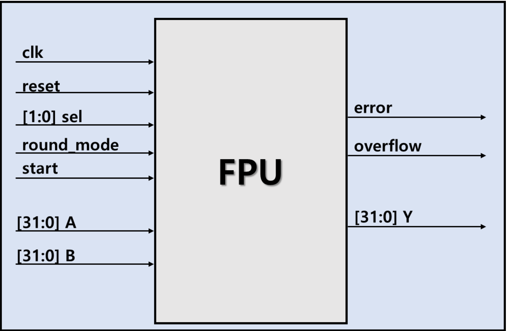
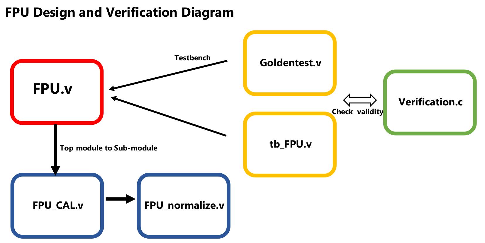
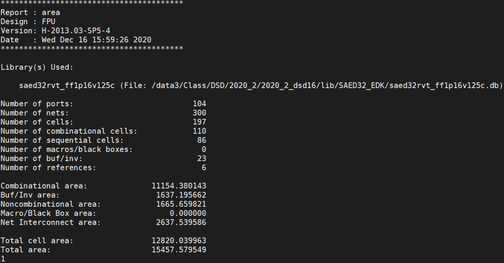
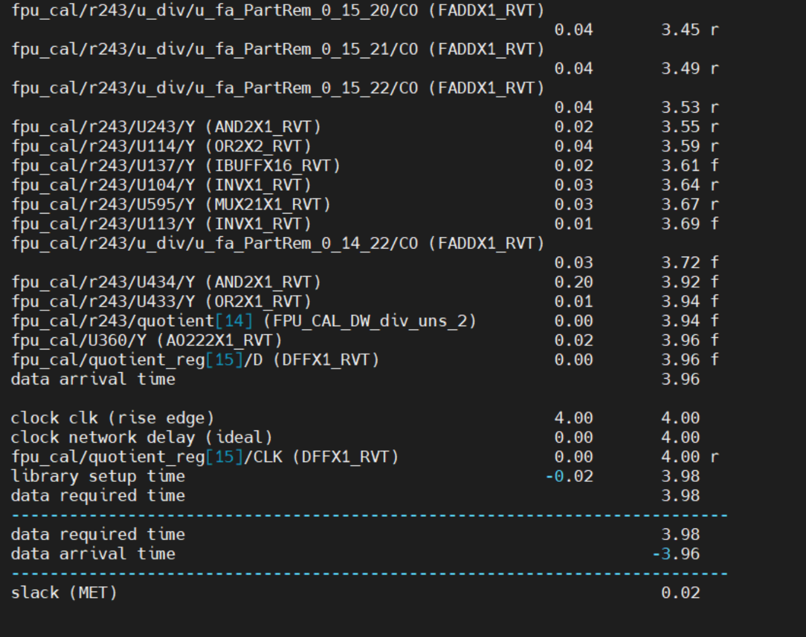

# Floating Point Unit
It is a verilog design and synthesis for 32-bits FPU following IEEE 754 standard. Four calculation modes are supported; addition, subtraction, multiplication, and division. All calculations are showing results within two cycles at 250MHz clock frequency.<br><br>

# I/O features
 </img><br>

* ### input
   * ```clk```
   * ```reset```
   * ```2-bits selection signal```
      * 2'b00: add
      * 2'b01: sub
      * 2'b10: mul
      * 2'b11: div
   * ```1-bit rounding mode selection signal```
      * 1'b0: rounding ties to even
      * 1'b1: rounding down
   * ```1-bit start signal```
   * ```32-bit floating point operand A, B```
* ### output
   * ```32-bit floating point result Y```
   * ```1-bit Overflow```
   * ```1-bit Error```
<br>
<br>

# Other features
* ### Rounding rules<br>
To achieve efficiency of operation, round to the ```8th digit``` after the decimal point.
   * ```Rounding ties to even```
      * Rounding up or rounding down to nearest value
      * If there are two nearest values, choosing round up or down which makes last fraction bit even
   * ```Rounding down```
      * Always round down toward -&infin;

* ### Exception handling
    * Invalid operation
        when NaN occurs, return NaN, return error 1
    * Division by zero
        Return &infin, return overflow 1
    * Overflow
        Return &infin, return overflow 1

<br>
<br>

# File structure for the FPU design and Verification
 </img><br><br>

 
# Synthesis spec
* ```Samsung 32nm library``` and ```Design Vision tool``` were applied for synthesis.
* ```total cell area = 12820```
 </img><br>
* Slack = ```0.02``` @ Clock frequency = ```250 MHz```. ```2 cyclces``` for calculation.
 </img><br>

